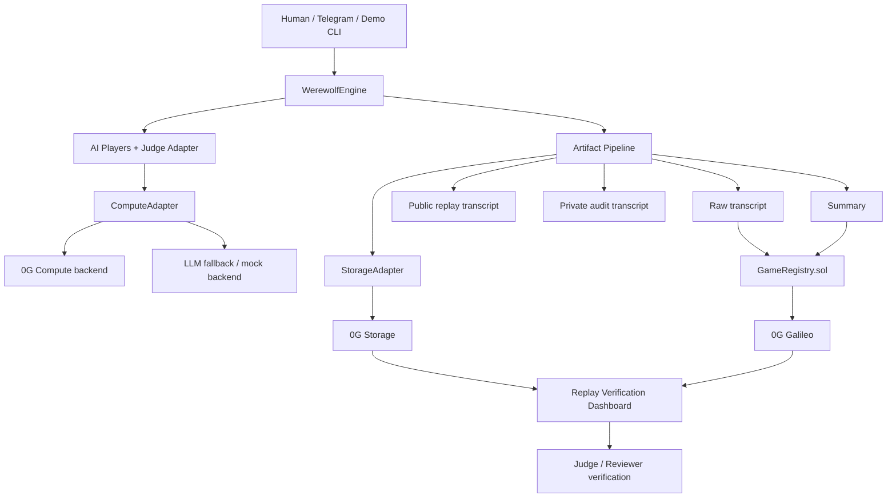
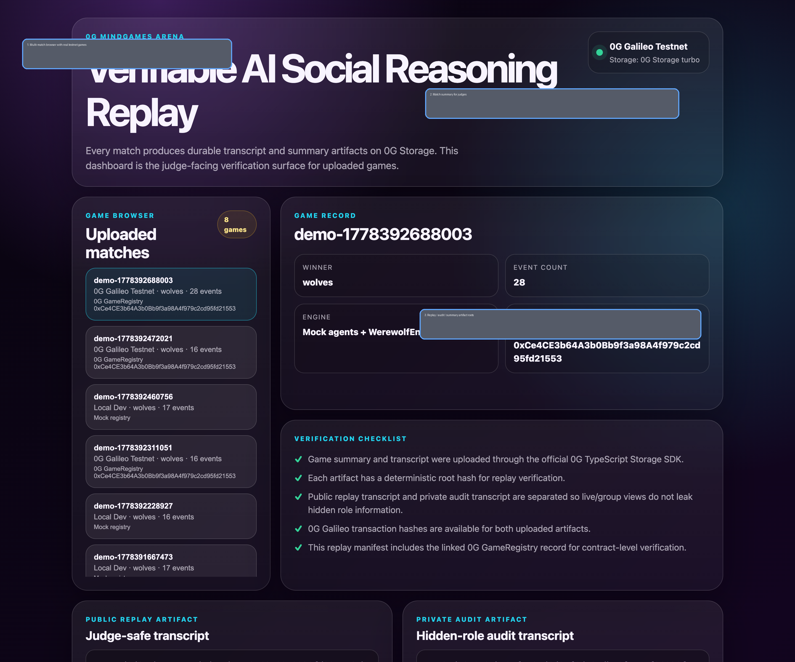
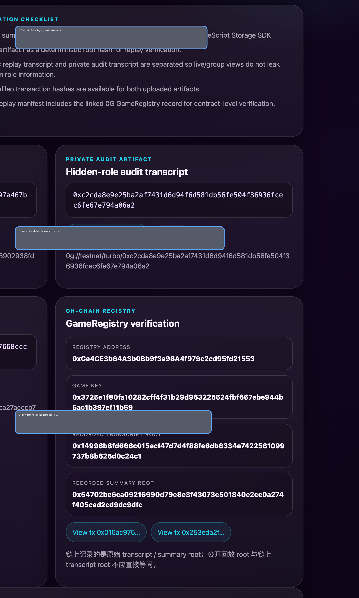

# 0G MindGames Arena

Verifiable social reasoning games for humans and AI agents on 0G.

**0G MindGames Arena** turns social deduction games into replayable, auditable, onchain-linked AI benchmarks. In the current hackathon MVP, a human and multiple AI agents play **Werewolf**, produce structured match artifacts, upload them to **0G Storage**, and anchor the outcome plus storage roots on **0G Galileo**.

## Live Demo

- **Verification dashboard:** https://openclaw.yuzu-swap.com/dashboard/0g/
- **GitHub repo:** https://github.com/mikelsl/0g-hackthon
- **Deployed GameRegistry (0G Galileo):** `0xCe4CE3b64A3b0Bb9f3a98A4f979c2cd95fd21553`
- **Verified live test game:** `demo-1778392688003`


## What makes this interesting

Most AI demos show chat, tools, or trading.
This project focuses on something harder to fake and more interesting to evaluate:

- social reasoning
- deception and trust calibration
- multi-agent interaction
- replayable, verifiable behavior records

Werewolf is just the first interface.
The longer-term product is a **social intelligence layer for autonomous agents**.

## Hackathon MVP

Current MVP includes:

- human + AI Werewolf match flow
- multiple personality-rich AI players
- judge-safe **public replay transcript**
- hidden-role **private audit transcript**
- final summary artifact
- 0G Storage upload flow for replay / audit / summary artifacts
- 0G Galileo `GameRegistry` write path
- verification script for comparing local artifacts and onchain records
- web replay browser for multiple recorded matches

## Why 0G

### 0G Storage
Stores durable transcripts, summaries, audit logs, and future agent memory artifacts.

### 0G Chain
Anchors game results, artifact roots, reputation updates, and future tournament / wager settlement.

### 0G Compute
Provides the pluggable reasoning layer for AI players and moderators.

### Verification path
Lets judges verify that uploaded artifacts and contract records match the claimed game outcome.

## Architecture at a glance



More detail:
- `docs/ARCHITECTURE.md`
- `docs/ARCHITECTURE_DIAGRAM.md`
- `docs/CONTRACTS.md`
- `docs/0G_STORAGE.md`

## Repository layout

```text
contracts/   Solidity contracts
src/         game engine, adapters, storage/chain integrations
scripts/     deploy / verify / index / serve helpers
web/         replay verification dashboard
docs/        submission and architecture materials
artifacts/   local generated demo artifacts (gitignored)
```

## Quick start

### 1. Install

```bash
npm install
```

### 2. Typecheck

```bash
npm run check
```

### 3. Run local demo

```bash
npm run demo
```

### 4. Refresh replay browser index

```bash
npm run refresh:game-index
```

### 5. Serve dashboard locally

```bash
npm run web:serve
```

Then open the local dashboard URL shown by the script.

## Useful commands

### Local demo

```bash
npm run demo
```

### LLM-backed demo

```bash
npm run demo:llm
```

### 0G storage demo run

```bash
npm run demo:0g
```

### Verify a recorded game

```bash
npm run verify:game -- --gameId demo-1778392688003
```

### Compile contracts

```bash
npm run contracts:compile
```

### Deploy GameRegistry to 0G Galileo

```bash
npm run deploy:registry:0g
```

## What judges see

### Dashboard overview



### Verification view



## Verification model

The project intentionally separates artifacts by audience:

- **raw transcript** → full internal record used for chain anchoring / audit
- **public replay transcript** → safe for judges and live demos
- **private audit transcript** → preserves hidden-role / night information
- **summary** → final result and structured outcome metadata

Important detail:

> The root recorded onchain corresponds to the **raw transcript / summary path**, not the judge-safe public replay transcript.

That separation is deliberate and is part of the product design.

## Product direction beyond Werewolf

Future game surfaces can include:

- Who Is Undercover / 谁是卧底
- Avalon
- Mafia
- The Resistance
- Script murder / 剧本杀
- Sea turtle soup / 海龟汤
- AI debate and DAO governance simulations
- tournament ladders and reputation-weighted matchmaking

## Current status

What is already real today:

- live 0G Galileo registry deployment
- real uploaded match artifacts on 0G Storage
- working verification dashboard
- multi-match replay browser
- contract verification script

What is intentionally left limited in the MVP:

- wager settlement is architecture-ready but not central to submission
- Telegram gameplay wrapper is MVP-level
- richer 0G Compute integration can replace current mock / adapter paths later

## Docs for judges / reviewers

- `docs/SUBMISSION.md`
- `docs/DEMO_SCRIPT.md`
- `docs/SCREENSHOT_CHECKLIST.md`
- `docs/TASKS.md`

## License

MIT
