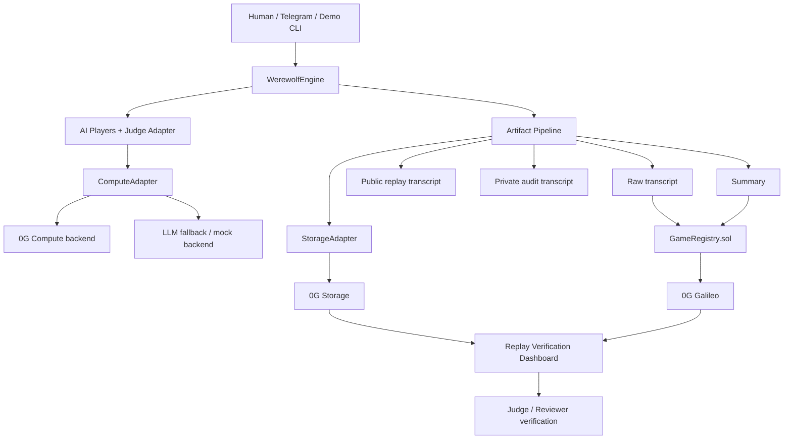

# Architecture Diagram

## Reading guide

- **WerewolfEngine** is the source of truth for room state, speeches, votes, night actions, and outcome.
- **ComputeAdapter** keeps reasoning backend-pluggable, so the MVP can use mock or LLM fallbacks while staying ready for deeper 0G Compute integration.
- **Artifact Pipeline** intentionally separates:
  - raw transcript
  - judge-safe public replay
  - private audit transcript
  - final summary
- **0G Storage + GameRegistry** together create the verification path used by the dashboard and CLI verifier.
